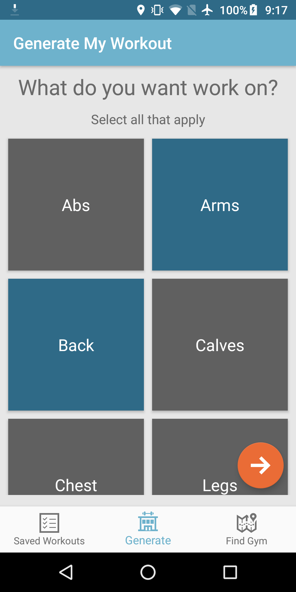
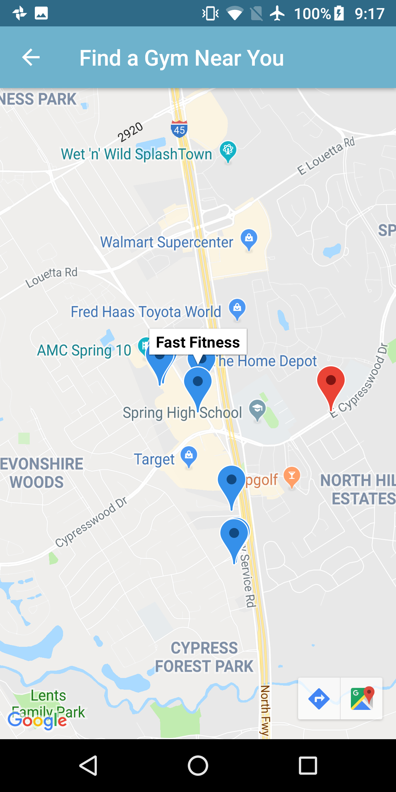
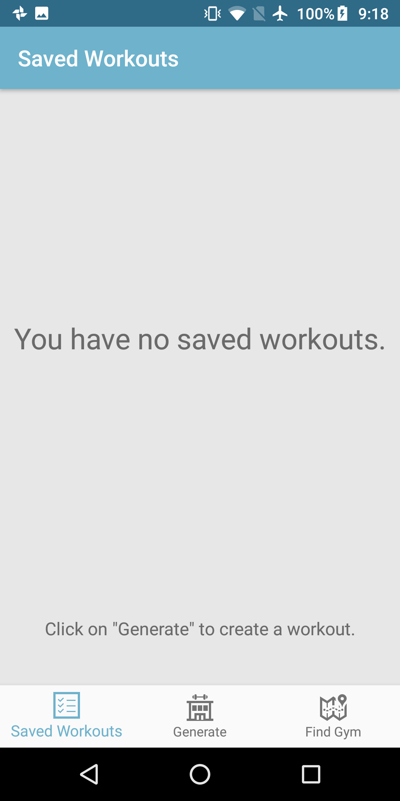
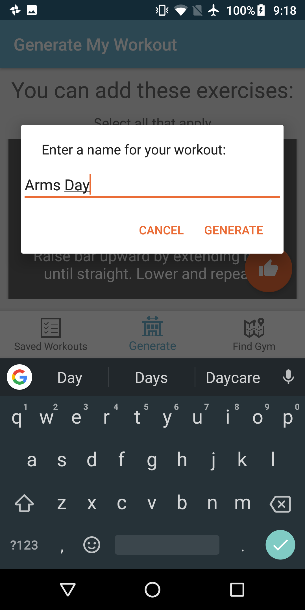
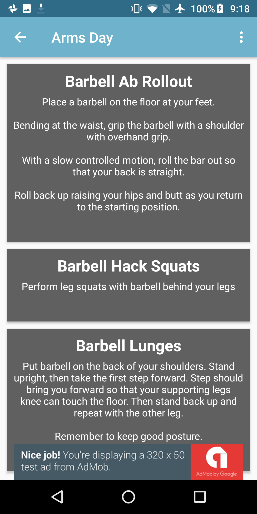

# FitMe (Android Developer Nanodegree Capstone Project)
FitMe, a fitness app that generates workouts based on given user input. This app was developed to demonstrate mastery of course content from the Android Developer Nanodegree program, provided by the Grow with Google Challenge 2018 scholarship.

## App Features
* Generate workouts from the Workout Manager API based on user input
* View previously saved workouts
* Add workout information to home screen
* Find nearby gyms based on current location

## Concepts Applied
This app covers all the key concepts in the Android Developer Nanodegree course.
* REST calls using AsyncTasks
* ContentProvider to retrieve SQLite data with use of Loader to populate UI
* Dynamic UI management using RecyclerViews
* Home screen widget functionality
* Third-party libraries: Picasso and ButterKnife
* Google Play Services: Admob, Maps, Location, and Places
* Material Design using AppCompat themes
* Signing configuration with use of keystore

## Screenshots

